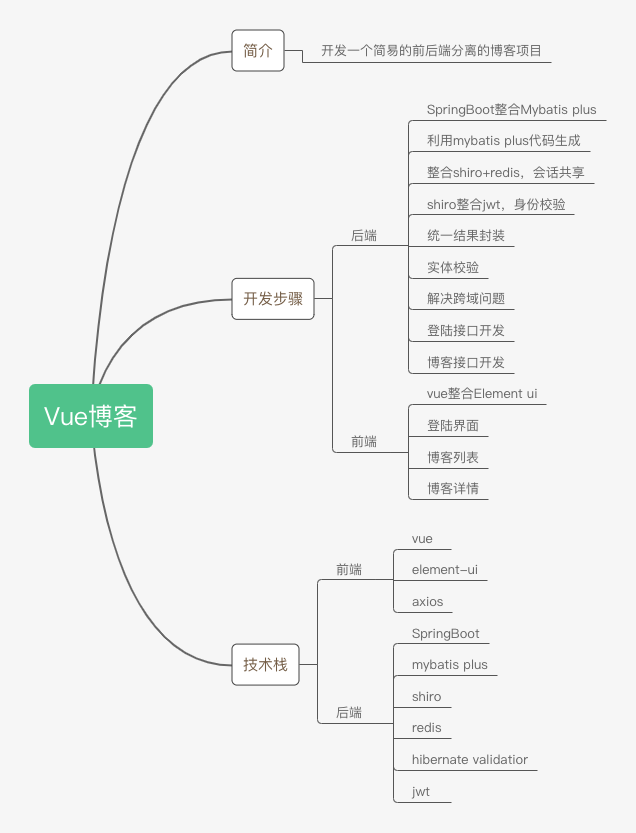

# Vue博客系统开发简介与大纲

## 技术栈简介

## 网站效果展示

---

## 项目来源

> [markerhub](https://www.markerhub.com/)的个人博客系统，因其技术栈基础适合系统学习前后端分离，遂学习模仿
>
> 注意:原教程使用的Vue2.0 个人使用Vue3.0其中相关接口方法还有Element Plus调用都已经改变，如需使用2.0版本请看原作者教程信息.