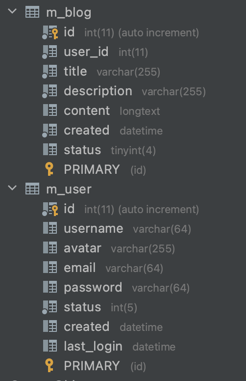
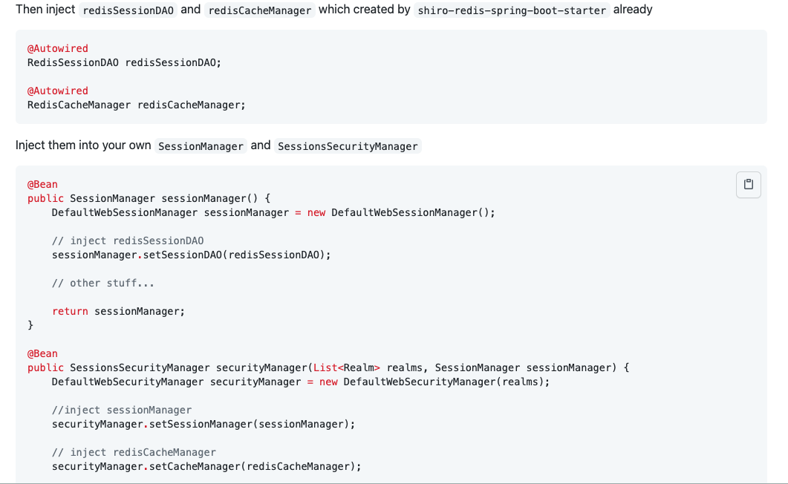
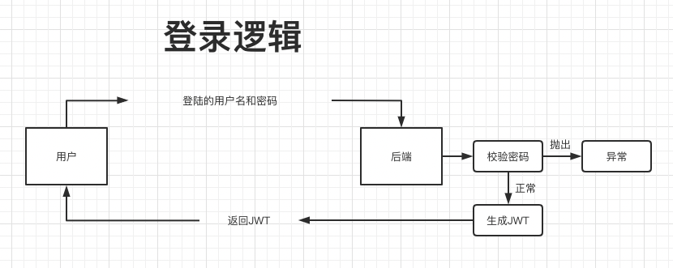
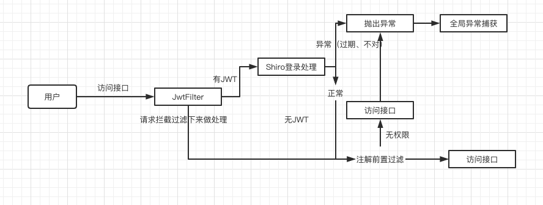
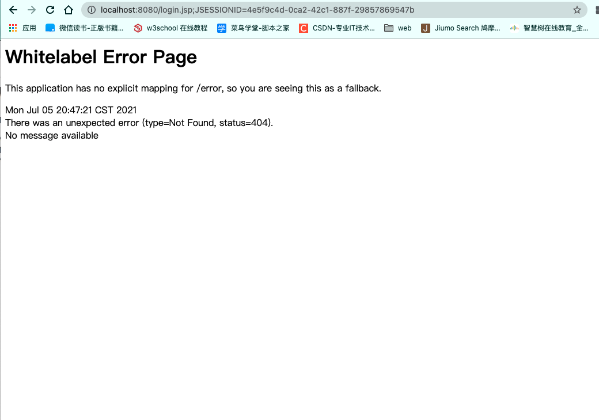
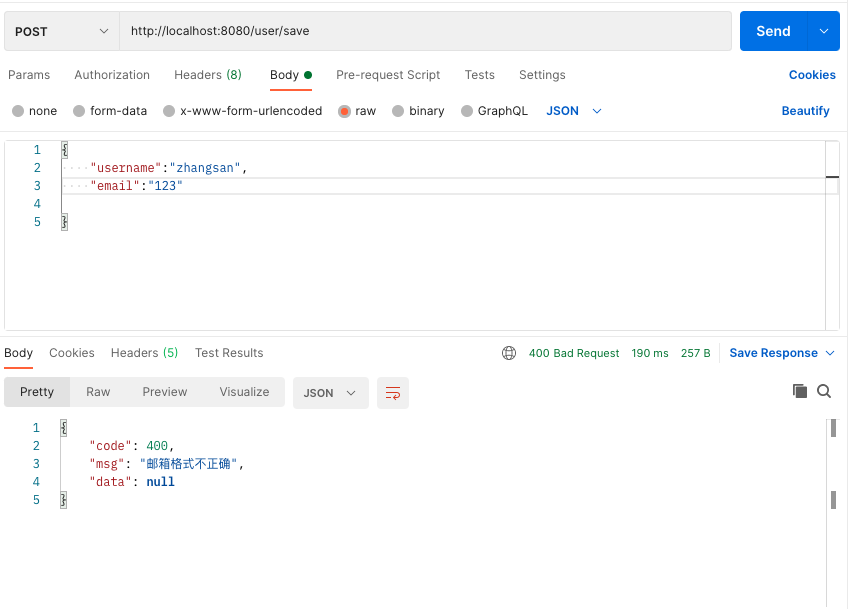
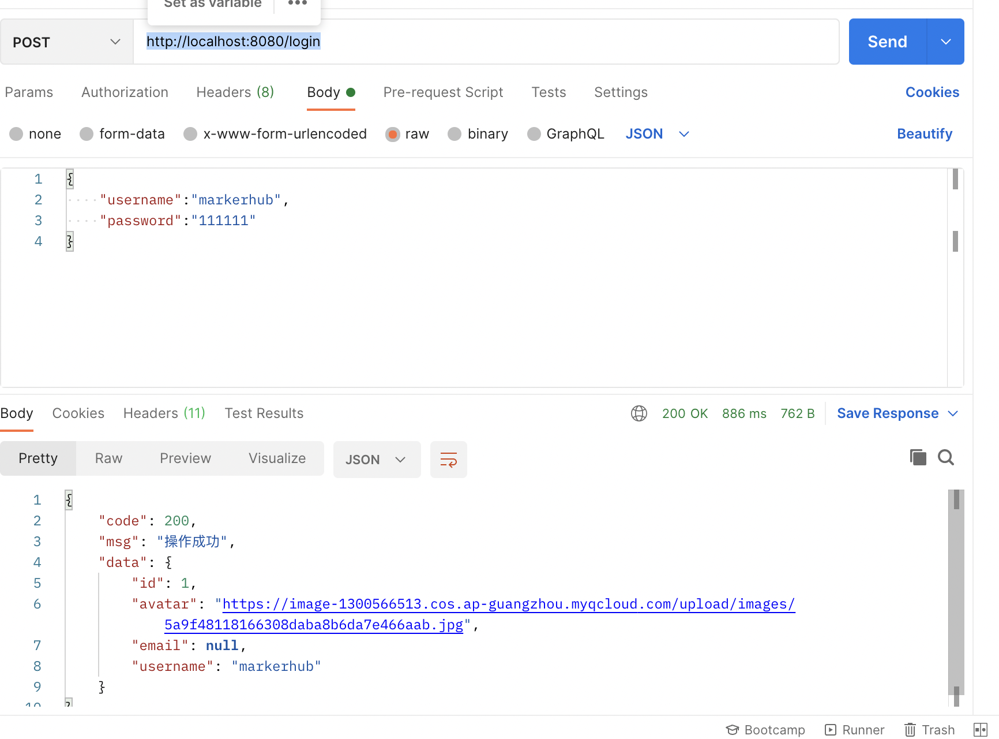
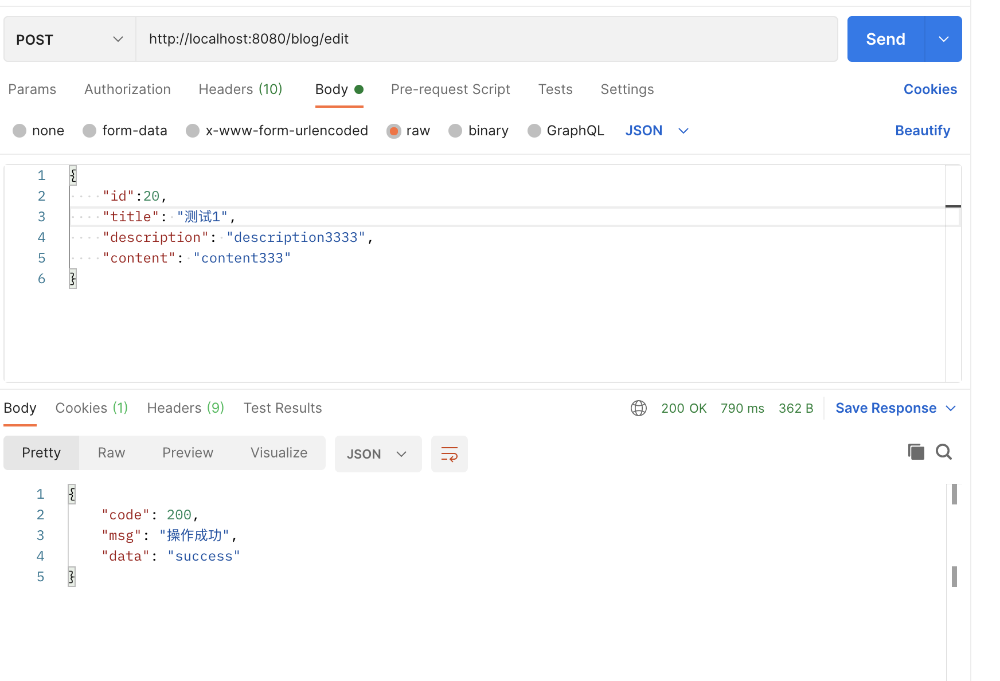
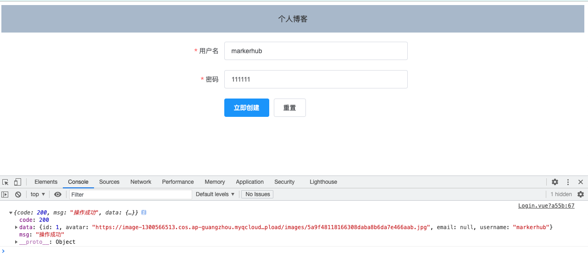

# Vue博客系统前后端分离

> Java后端接口开发

## 前言

从零开始搭建一个**项目骨架**，适合微服务化体系等，以***SpringBoot***作为框架基础，这是离不开的。

**数据层**，我们常用***Mybatis***，易上手，方便维护。但是单表操作比较困难，添加字段或者减少字段的时候比较繁琐，所以此处使用***Mybatis Plus***，为简化开发而生，只需简单配置，即可快速进行CRUD操作，节省大量时间。

**权限管理**，***Shiro***配置简单，使用方便，所以使用Shiro为我们的权限。

考虑到项目可能需要部署多台，这时候需要**会话等信息共享**，***Redis***是现在*<u>主流中间件</u>*，也适合我们的项目。

**前后端分离**，所以使用***jwt***作为*<u>用户身份凭证</u>*。

---

## 技术栈

- SpringBoot
- Mybatis Plus
- Shiro
- Lombok
- Redis
- Hibernate validatior
- jwt

---

## 环境配置

> 开发工具与环境

Idea、Mysql、JDK1.8、Maven

---

## 开发

### 新建SpringBoot项目

#### 导入依赖

> 导入的基础jar包

```xml
<!--Spring Boot DevTools热加载-->
<dependency>
  <groupId>org.springframework.boot</groupId>
  <artifactId>spring-boot-devtools</artifactId>
  <scope>runtime</scope>
	<optional>true</optional>
</dependency>

<!--Lombok-->
<dependency>
  <groupId>org.projectlombok</groupId>
  <artifactId>lombok</artifactId>
  <optional>true</optional>
</dependency>

<!--Spring Web-->
<dependency>
  <groupId>org.springframework.boot</groupId>
  <artifactId>spring-boot-starter-web</artifactId>
</dependency>

<!--mysql-->
<dependency>
  <groupId>mysql</groupId>
  <artifactId>mysql-connector-java</artifactId>
  <scope>runtime</scope>
</dependency>
```

---

### 整合Mybatis Plus

#### 导入依赖

> 导入jar依赖

```xml
<!--mybatis plus-->
<dependency>
  <groupId>com.baomidou</groupId>
  <artifactId>mybatis-plus-boot-starter</artifactId>
  <version>3.2.0</version>
</dependency>
<!--freemarker页面模版引擎｜用于代码生成-->
<dependency>
  <groupId>org.springframework.boot</groupId>
  <artifactId>spring-boot-starter-freemarker</artifactId>
</dependency>
<!--mybatis plus代码生成器-->
<dependency>
  <groupId>com.baomidou</groupId>
  <artifactId>mybatis-plus-generator</artifactId>
  <version>3.2.0</version>
</dependency>
```

---

#### 编写配置文件

> application.yml

```yml
# DataSource Config
spring:
  datasource:
    driver-class-name: com.mysql.cj.jdbc.Driver
    url: jdbc:mysql://localhost:3306/vueblog?useUnicode=true&useSSL=false&characterEncoding=utf8&serverTimezone=Asia/Shanghai
    username: root
    password: 123456
# 要注意配置mybatis plus的mapper的xml文件扫描路径
mybatis-plus:
  mapper-locations: classpath*:/mapper/**Mapper.xml

```

---

#### 开启mapper扫描，添加分页插件

> 通过``@mapperScan`注解指定要变成实现类的接口所在的包，然后包下的所有接口都会生成相应的实现类。
>
> **PaginationInterceptor**是一个分页插件

- com.cxy.vueblogbg.config.MybatisPlusConfig

```java
@Configuration
@EnableTransactionManagement
@MapperScan("com.cxy.vueblogbg.mapper")
public class MybatisPlusConfig {
    @Bean
    public PaginationInterceptor paginationInterceptor() {
        PaginationInterceptor paginationInterceptor = new PaginationInterceptor();
        return paginationInterceptor;
    }
}
```

---

#### 代码生成

>官方给我们提供了一个代码生成器，然后我写上自己的参数之后，就可以直接根据数据库表信息生成entity、service、mapper等接口和实现类。

- com.cxy.vueblogbg.CodeGenerator

```java
public class CodeGenerator {

    /**
     * <p>
     * 读取控制台内容
     * </p>
     */
    public static String scanner(String tip) {
        Scanner scanner = new Scanner(System.in);
        StringBuilder help = new StringBuilder();
        help.append("请输入" + tip + "：");
        System.out.println(help.toString());
        if (scanner.hasNext()) {
            String ipt = scanner.next();
            if (StringUtils.isNotEmpty(ipt)) {
                return ipt;
            }
        }
        throw new MybatisPlusException("请输入正确的" + tip + "！");
    }

    public static void main(String[] args) {
        // 代码生成器
        AutoGenerator mpg = new AutoGenerator();

        // 全局配置
        GlobalConfig gc = new GlobalConfig();
        String projectPath = System.getProperty("user.dir");
        gc.setOutputDir(projectPath + "/src/main/java");
        gc.setAuthor("xing-yu-chen");
        gc.setOpen(false);
        // gc.setSwagger2(true); 实体属性 Swagger2 注解
        gc.setServiceName("%sService");
        mpg.setGlobalConfig(gc);

        // 数据源配置
        DataSourceConfig dsc = new DataSourceConfig();
        dsc.setUrl("jdbc:mysql://localhost:3306/vueblog?useUnicode=true&useSSL=false&characterEncoding=utf8&serverTimezone=UTC");
        // dsc.setSchemaName("public");
        dsc.setDriverName("com.mysql.cj.jdbc.Driver");
        dsc.setUsername("root");
        dsc.setPassword("123456");
        mpg.setDataSource(dsc);

        // 包配置
        PackageConfig pc = new PackageConfig();
        pc.setModuleName(null);
      	//常用用于生成位置的包名
        pc.setParent("com.cxy.vueblogbg");
        mpg.setPackageInfo(pc);

        // 自定义配置
        InjectionConfig cfg = new InjectionConfig() {
            @Override
            public void initMap() {
                // to do nothing
            }
        };

        // 如果模板引擎是 freemarker
        String templatePath = "/templates/mapper.xml.ftl";
        // 如果模板引擎是 velocity
        // String templatePath = "/templates/mapper.xml.vm";

        // 自定义输出配置
        List<FileOutConfig> focList = new ArrayList<>();
        // 自定义配置会被优先输出
        focList.add(new FileOutConfig(templatePath) {
            @Override
            public String outputFile(TableInfo tableInfo) {
                // 自定义输出文件名 ， 如果你 Entity 设置了前后缀、此处注意 xml 的名称会跟着发生变化！！
                return projectPath + "/src/main/resources/mapper/"
                        + "/" + tableInfo.getEntityName() + "Mapper" + StringPool.DOT_XML;
            }
        });

        cfg.setFileOutConfigList(focList);
        mpg.setCfg(cfg);

        // 配置模板
        TemplateConfig templateConfig = new TemplateConfig();

        templateConfig.setXml(null);
        mpg.setTemplate(templateConfig);

        // 策略配置
        StrategyConfig strategy = new StrategyConfig();
        strategy.setNaming(NamingStrategy.underline_to_camel);
        strategy.setColumnNaming(NamingStrategy.underline_to_camel);
        strategy.setEntityLombokModel(true);
        strategy.setRestControllerStyle(true);
        strategy.setInclude(scanner("表名，多个英文逗号分割").split(","));
        strategy.setControllerMappingHyphenStyle(true);
        strategy.setTablePrefix("m_");
        mpg.setStrategy(strategy);
        mpg.setTemplateEngine(new FreemarkerTemplateEngine());
        mpg.execute();
    }
}
```

---

#### 数据库建表

> 本项目中生成两个表**m_user**和**m_blog**



生成之后，运行**代码生成器**。

> 测试代码

```java
@SpringBootTest
class VueBlogBgApplicationTests {

    @Autowired
    private UserService userService;
    @Test
    void contextLoads() {
        System.out.println(userService.getById(1L));
    }
}
//得到
User(id=1, username=zhangsan, avatar=null, email=null, password=null, status=1, created=null, lastLogin=null)
```

运行成功。

---

### 封装统一结果

> 用到了一个**Result**的类，这个用于我们的异步统一返回的结果封装。
>
> 一般来说，结果里面有几个要素是必要的。

- 是否成功，可用code表示(如200表示成功，400表示异常)
- 结果消息
- 结果数据

> 封装如下

- com.cxy.vueblogbg .common.lang.Result

```java
@Data
public class Result implements Serializable {
    //200是正常，非200表示异常
    private int code;
    private String msg;
    private Object data;

    //成功的结果
    public static Result succ(Object data){
        return succ(200,"操作成功",data);
    }

    public static Result succ(int code,String msg,Object data){
        Result result=new Result();
        result.setCode(code);
        result.setMsg(msg);
        result.setData(data);
        return result;
    }

    //异常数据的调用方法
    //数据异常｜密码错误等
    public static Result succ(String msg){
       return fail(400,msg,null);
    }

    //返回错误方法
    public static Result fail(String msg,Object data){
        return fail(400,msg,data);
    }

    public static Result fail(int code,String msg,Object data){
        Result result=new Result();
        result.setCode(code);
        result.setMsg(msg);
        result.setData(data);
        return result;
    }
}
```

> 测试

```java
@RestController
@RequestMapping("/user")
public class UserController {
    @Autowired
    private UserService userService;
    @GetMapping("/id")
    public Result getUserId(){
        User byId = userService.getById(1L);
        return Result.succ(byId);
    }
}
```

```json
{
  "code": 200,
  "msg": "操作成功",
  "data": {
    "id": 1,
    "username": "zhangsan",
    "avatar": null,
    "email": null,
    "password": null,
    "status": 1,
    "created": null,
    "lastLogin": null
  }
}
```

---

### 整合shiro+jwt与会话共享

>考虑到后面可能需要做集群、负载均衡等，所以就需要会话共享，而shiro的缓存和会话信息，我们一般考虑使用redis来存储这些数据，所以，我们不仅仅需要整合shiro，同时也需要整合redis。在开源的项目中，我们找到了一个starter可以快速整合shiro-redis，配置简单，这里也推荐大家使用。
>
>**我们会采用token或者jwt作为跨域身份验证解决方案。所以整合shiro的过程中，我们需要引入jwt的身份验证过程。**

#### 官方文档

https://github.com/alexxiyang/shiro-redis/blob/master/docs/README.md#spring-boot-starter



此处重写自定义。

#### 导入依赖包

> 导入shiro-redis的starter包，还有jwt工具包，以及简化开发的hutool工具包

```xml
<!--shiro-redis-->
<dependency>
  <groupId>org.crazycake</groupId>
  <artifactId>shiro-redis-spring-boot-starter</artifactId>
  <version>3.2.1</version>
</dependency>

<!-- hutool工具类-->
<dependency>
  <groupId>cn.hutool</groupId>
  <artifactId>hutool-all</artifactId>
  <version>5.3.3</version>
</dependency>

<!-- jwt -->
<dependency>
  <groupId>io.jsonwebtoken</groupId>
  <artifactId>jjwt</artifactId>
  <version>0.9.1</version>
</dependency>
```

#### 登录逻辑





#### 代码逻辑流程

##### ShiroConfig

```java
@Configuration
public class ShiroConfig {
    @Bean
    public SessionManager sessionManager(RedisSessionDAO redisSessionDAO) {
        DefaultWebSessionManager sessionManager = new DefaultWebSessionManager();
        sessionManager.setSessionDAO(redisSessionDAO);
        return sessionManager;
    }

    @Bean
    public SessionsSecurityManager securityManager(AccountRealm accountRealm,
                                                   SessionManager sessionManager,
                                                   RedisCacheManager redisCacheManager) {
        DefaultWebSecurityManager securityManager = new DefaultWebSecurityManager(accountRealm);
        securityManager.setSessionManager(sessionManager);
        securityManager.setCacheManager(redisCacheManager);
        return securityManager;
    }
    //shiro过滤器链的定义，定义哪些链接需要经过哪些过滤器
    @Bean
    public ShiroFilterChainDefinition shiroFilterChainDefinition() {
        DefaultShiroFilterChainDefinition chainDefinition = new DefaultShiroFilterChainDefinition();
        Map<String, String> filterMap = new LinkedHashMap<>();
        filterMap.put("/**", "authc"); // 主要通过注解方式校验权限
        chainDefinition.addPathDefinitions(filterMap);
        return chainDefinition;
    }
    @Bean("shiroFilterFactoryBean")
    public ShiroFilterFactoryBean shiroFilterFactoryBean(SecurityManager securityManager,
                                                         ShiroFilterChainDefinition shiroFilterChainDefinition) {
        ShiroFilterFactoryBean shiroFilter = new ShiroFilterFactoryBean();
        shiroFilter.setSecurityManager(securityManager);
//        Map<String, Filter> filters = new HashMap<>();
//        filters.put("jwt", jwtFilter);
//        shiroFilter.setFilters(filters);
        Map<String, String> filterMap = shiroFilterChainDefinition.getFilterChainMap();
        shiroFilter.setFilterChainDefinitionMap(filterMap);
        return shiroFilter;
    }

}
```

##### 导包问题

```java
import com.cxy.vueblogbg.shiro.AccountRealm;
import org.apache.shiro.mgt.SessionsSecurityManager;
import org.apache.shiro.session.mgt.SessionManager;
import org.apache.shiro.mgt.SecurityManager;
import org.apache.shiro.spring.web.ShiroFilterFactoryBean;
import org.apache.shiro.spring.web.config.DefaultShiroFilterChainDefinition;
import org.apache.shiro.spring.web.config.ShiroFilterChainDefinition;
import org.apache.shiro.web.mgt.DefaultWebSecurityManager;
import org.apache.shiro.web.session.mgt.DefaultWebSessionManager;
import org.crazycake.shiro.RedisCacheManager;
import org.crazycake.shiro.RedisSessionDAO;
import org.springframework.context.annotation.Bean;
import org.springframework.context.annotation.Configuration;

import java.util.LinkedHashMap;
import java.util.Map;
```

##### AccountRealm

```java
@Component
public class AccountRealm extends AuthorizingRealm {
    //获取权限
    @Override
    protected AuthorizationInfo doGetAuthorizationInfo(PrincipalCollection principalCollection) {
        return null;
    }

    //身份验证
    @Override
    protected AuthenticationInfo doGetAuthenticationInfo(AuthenticationToken authenticationToken) throws AuthenticationException {
        return null;
    }
}
```

##### 测试

> localhost:8080/user/id
>
> 成功拦截



#### 完整版Shiro代码流程

##### ShiroConfig

> com.cxy.vueblogbg.config.ShiroConfig

```java
import com.cxy.vueblogbg.shiro.AccountRealm;
import com.cxy.vueblogbg.shiro.JwtFilter;
import org.apache.shiro.mgt.SessionsSecurityManager;
import org.apache.shiro.session.mgt.SessionManager;
import org.apache.shiro.mgt.SecurityManager;
import org.apache.shiro.spring.web.ShiroFilterFactoryBean;
import org.apache.shiro.spring.web.config.DefaultShiroFilterChainDefinition;
import org.apache.shiro.spring.web.config.ShiroFilterChainDefinition;
import org.apache.shiro.web.mgt.DefaultWebSecurityManager;
import org.apache.shiro.web.session.mgt.DefaultWebSessionManager;
import org.crazycake.shiro.RedisCacheManager;
import org.crazycake.shiro.RedisSessionDAO;
import org.springframework.beans.factory.annotation.Autowired;
import org.springframework.context.annotation.Bean;
import org.springframework.context.annotation.Configuration;

import javax.servlet.Filter;
import java.util.HashMap;
import java.util.LinkedHashMap;
import java.util.Map;

@Configuration
public class ShiroConfig {

    @Autowired
    private JwtFilter jwtFilter;

    @Bean
    public SessionManager sessionManager(RedisSessionDAO redisSessionDAO) {
        DefaultWebSessionManager sessionManager = new DefaultWebSessionManager();
        sessionManager.setSessionDAO(redisSessionDAO);
        return sessionManager;
    }

    @Bean
    public SessionsSecurityManager securityManager(AccountRealm accountRealm,
                                                   SessionManager sessionManager,
                                                   RedisCacheManager redisCacheManager) {
        DefaultWebSecurityManager securityManager = new DefaultWebSecurityManager(accountRealm);
        securityManager.setSessionManager(sessionManager);
        securityManager.setCacheManager(redisCacheManager);
        return securityManager;
    }
    //shiro过滤器链的定义，定义哪些链接需要经过哪些过滤器
    @Bean
    public ShiroFilterChainDefinition shiroFilterChainDefinition() {
        DefaultShiroFilterChainDefinition chainDefinition = new DefaultShiroFilterChainDefinition();
        Map<String, String> filterMap = new LinkedHashMap<>();
        filterMap.put("/**", "jwt"); // 主要通过注解方式校验权限
        chainDefinition.addPathDefinitions(filterMap);
        return chainDefinition;
    }
    @Bean("shiroFilterFactoryBean")
    public ShiroFilterFactoryBean shiroFilterFactoryBean(SecurityManager securityManager,
                                                         ShiroFilterChainDefinition shiroFilterChainDefinition) {
        ShiroFilterFactoryBean shiroFilter = new ShiroFilterFactoryBean();
        shiroFilter.setSecurityManager(securityManager);
        Map<String, Filter> filters = new HashMap<>();
        filters.put("jwt", jwtFilter);
        shiroFilter.setFilters(filters);
        Map<String, String> filterMap = shiroFilterChainDefinition.getFilterChainMap();
        shiroFilter.setFilterChainDefinitionMap(filterMap);
        return shiroFilter;
    }
}
```

上面ShiroConfig，我们主要做了几件事情：

1. 引入**RedisSessionDAO**和**RedisCacheManager**，为了<u>解决shiro的权限数据和会话信息能保存到redis中</u>，实现会话共享。
2. 重写了**SessionManager**和**DefaultWebSecurityManager**，同时在**DefaultWebSecurityManager**中为了<u>关闭shiro自带的session方式</u>，我们需要设置为false，这样用户就不再能通过session方式登录shiro。后面将<u>采用jwt凭证登录</u>。
3. 在**ShiroFilterChainDefinition**中，我们不再通过编码形式拦截Controller访问路径，而是所有的路由都需要经过<u>JwtFilter过滤器</u>，然后判断请求头中是否含有jwt的信息，有就登录，没有就跳过。跳过之后，有Controller中的shiro注解进行再次拦截，比如**@RequiresAuthentication**，这样控制权限访问。

那么，接下来，我们聊聊ShiroConfig中出现的**AccountRealm**，还有**JwtFilter**。

##### AccountRealm

> AccountRealm是shiro进行登录或者权限校验的逻辑所在,我们需要重写3个方法:
>
> - supports：为了让realm支持jwt的凭证校验
> - doGetAuthorizationInfo：权限校验
> - doGetAuthenticationInfo：登录认证校验

- com.cxy.vueblogbg.shiro.AccountRealm

```java
import cn.hutool.core.bean.BeanUtil;
import com.cxy.vueblogbg.entity.User;
import com.cxy.vueblogbg.service.UserService;
import com.cxy.vueblogbg.util.JwtUtils;
import org.apache.shiro.authc.*;
import org.apache.shiro.authz.AuthorizationInfo;
import org.apache.shiro.realm.AuthorizingRealm;
import org.apache.shiro.subject.PrincipalCollection;
import org.springframework.beans.factory.annotation.Autowired;
import org.springframework.stereotype.Component;

@Component
public class AccountRealm extends AuthorizingRealm {

    @Autowired
    private JwtUtils jwtUtils;

    @Autowired
    private UserService userService;

    //告诉它支持的token类型是jwttoken,而非其他的token
    @Override
    public boolean supports(AuthenticationToken token) {
        return token instanceof JwtToken;
    }

    //获取权限
    @Override
    protected AuthorizationInfo doGetAuthorizationInfo(PrincipalCollection principalCollection) {
        return null;
    }

    //身份验证
    @Override
    protected AuthenticationInfo doGetAuthenticationInfo(AuthenticationToken authenticationToken) throws AuthenticationException {
        //登陆逻辑开发
        JwtToken jwtToken=(JwtToken)authenticationToken;
        String userId = jwtUtils.getClaimByToken((String) jwtToken.getPrincipal()).getSubject();
        User user = userService.getById(Long.valueOf(userId));
        if(user == null){
            throw new UnknownAccountException("账户不存在");
        }
        if(user.getStatus()==-1){
            //如果账户被锁定
            throw new LockedAccountException("账户已被锁定");
        }
        AccountProfile profile=new AccountProfile();
        //把公开的用户信息copy到profile里
        BeanUtil.copyProperties(user,profile);

        System.out.println("------");
        return new SimpleAuthenticationInfo(profile,jwtToken.getCredentials(),getName());
    }
}
```

其实主要就是**doGetAuthenticationInfo**<u>登录认证</u>这个方法，可以看到我们通过<u>jwt获取到用户信息，判断用户的状态，最后异常就抛出对应的异常信息，否者封装成SimpleAuthenticationInfo返回给shiro</u>。 接下来我们逐步分析里面出现的新类：

shiro默认supports的是UsernamePasswordToken，而我们现在采用了jwt的方式，所以这里我们<u>自定义一个JwtToken</u>，来完成shiro的supports方法。

##### JwtToken

> com.cxy.vueblogbg.shiro.JwtToken

```java
public class JwtToken implements AuthenticationToken {

    private String token;

    public JwtToken(String jwt){
        this.token=jwt;
    }

    //获取授权用户信息
    @Override
    public Object getPrincipal() {
        return token;
    }

    //返回密钥信息
    @Override
    public Object getCredentials() {
        return token;
    }
}
```

##### JwtUtils

> JwtUtils是个生成和校验jwt的工具类，其中有些jwt相关的密钥信息是从项目配置文件中配置的
>
> com.cxy.vueblogbg.util.JwtUtils

```java
@Slf4j
@Data
@Component
@ConfigurationProperties(prefix = "markerhub.jwt")
public class JwtUtils {
    //需要配置配置文件
    //yml里markhub的hwt说明
    //密钥
    private String secret;

    //过期时间
    private long expire;

    //信息
    private String header;

    /**
     * 生成jwt token
     */
    public String generateToken(long userId) {
        Date nowDate = new Date();
        //过期时间
        Date expireDate = new Date(nowDate.getTime() + expire * 1000);

        return Jwts.builder()
                .setHeaderParam("typ", "JWT")
                .setSubject(userId+"")
                .setIssuedAt(nowDate)
                .setExpiration(expireDate)
                .signWith(SignatureAlgorithm.HS512, secret)
                .compact();
    }

    public Claims getClaimByToken(String token) {
        try {
            return Jwts.parser()
                    .setSigningKey(secret)
                    .parseClaimsJws(token)
                    .getBody();
        }catch (Exception e){
            log.debug("validate is token error ", e);
            return null;
        }
    }

    /**
     * token是否过期
     * @return  true：过期
     */
    public boolean isTokenExpired(Date expiration) {
        return expiration.before(new Date());
    }
```

> application.yml

```yml
shiro-redis:
  enabled:true
  redis-manager:
    host:127.0.0.1:6379
markerhub:
  jwt:
    secret: f4e2e52034348f86b67cde581c0f9eb5
    expire: 604800
    header: Authorization
```

在AccountRealm我们还用到了AccountProfile，这是为了登录成功之后返回的一个用户信息的载体。

##### AccountProfile

> com.cxy.vueblogbg.shiro.AccountProfile

```java
//非私密信息封装用于给Shiro公开
@Data
public class AccountProfile implements Serializable {
    private Long id;
    private String username;
    private String avatar;
    private String email;
}
```

##### JwtFilter

> 定义jwt的过滤器JwtFilter
>
> 个过滤器是我们的重点，这里我们继承的是Shiro内置的AuthenticatingFilter，一个可以内置了可以自动登录方法的的过滤器，有些同学继承BasicHttpAuthenticationFilter也是可以的。
>
> 我们需要重写几个方法：
>
> 1. createToken：实现登录，我们需要生成我们自定义支持的JwtToken
>
> 2. onAccessDenied：拦截校验，当头部没有Authorization时候，我们直接通过，不需要自动登录；当带有的时候，首先我们校验jwt的有效性，没问题我们就直接执行executeLogin方法实现自动登录
>
> 3. onLoginFailure：登录异常时候进入的方法，我们直接把异常信息封装然后抛出
>
> 4. preHandle：拦截器的前置拦截，因为我们是前后端分析项目，项目中除了需要跨域全局配置之外，我们再拦截器中也需要提供跨域支持。这样，拦截器才不会在进入Controller之前就被限制了。

- com.cxy.vueblogbg.shiro.JwtFilter

```java
import cn.hutool.json.JSONUtil;
import com.baomidou.mybatisplus.core.toolkit.StringUtils;
import com.cxy.vueblogbg.common.lang.Result;
import com.cxy.vueblogbg.util.JwtUtils;
import io.jsonwebtoken.Claims;
import org.apache.shiro.authc.AuthenticationException;
import org.apache.shiro.authc.AuthenticationToken;
import org.apache.shiro.authc.ExpiredCredentialsException;
import org.apache.shiro.web.filter.authc.AuthenticatingFilter;
import org.springframework.beans.factory.annotation.Autowired;
import org.springframework.stereotype.Component;

import javax.servlet.ServletRequest;
import javax.servlet.ServletResponse;
import javax.servlet.http.HttpServletRequest;
import javax.servlet.http.HttpServletResponse;
import java.io.IOException;

@Component
public class JwtFilter extends AuthenticatingFilter {

    @Autowired
    private JwtUtils jwtUtils;
    @Override
    protected AuthenticationToken createToken(ServletRequest servletRequest, ServletResponse servletResponse) throws Exception {
        HttpServletRequest request = (HttpServletRequest) servletRequest;
        String jwt = request.getHeader("Authorization");
        //如果没有就返回空，如果有才进行封装成token的形式
        if(StringUtils.isEmpty(jwt)){
            //如果jwt是空的，登录是没必要登陆的直接跳过即可
            return null;
        }
        return new JwtToken(jwt);
    }

    //拦截
    @Override
    protected boolean onAccessDenied(ServletRequest servletRequest, ServletResponse servletResponse) throws Exception {
        HttpServletRequest request = (HttpServletRequest) servletRequest;
        String jwt = request.getHeader("Authorization");
        //如果没有就返回空，如果有才进行封装成token的形式
        if(StringUtils.isEmpty(jwt)){
            //如果jwt是空的，不需要拦截，直接可以访问controller
            return true;
        }else{
            //校验jwt
            //获取头部信息
            Claims claimByToken = jwtUtils.getClaimByToken(jwt);
            //如果token等于空或者过期的话都抛出异常
            if(claimByToken==null&&jwtUtils.isTokenExpired(claimByToken.getExpiration())){
                throw new ExpiredCredentialsException("token已失效，请重新登陆");
            }
            //登录处理
            return executeLogin(servletRequest,servletResponse);
        }
    }

    //重写loginfailture的方法，显示有格式的错误信息,登陆异常的情况
    @Override
    protected boolean onLoginFailure(AuthenticationToken token, AuthenticationException e, ServletRequest request, ServletResponse response) {
        HttpServletResponse httpServletResponse = (HttpServletResponse) response;
        //e.getCause()获取错误原因
        Throwable throwable = e.getCause() == null ? e : e.getCause();
        Result fail = Result.fail(throwable.getMessage());
        String json= JSONUtil.toJsonStr(fail);
        try {
            httpServletResponse.getWriter().print(json);
        } catch (IOException ioException) {
            ioException.printStackTrace();
        }
        return false;
    }
  
   /**
     * 对跨域提供支持
     */
    @Override
    protected boolean preHandle(ServletRequest request, ServletResponse response) throws Exception {
        HttpServletRequest httpServletRequest = WebUtils.toHttp(request);
        HttpServletResponse httpServletResponse = WebUtils.toHttp(response);
        httpServletResponse.setHeader("Access-control-Allow-Origin", httpServletRequest.getHeader("Origin"));
        httpServletResponse.setHeader("Access-Control-Allow-Methods", "GET,POST,OPTIONS,PUT,DELETE");
        httpServletResponse.setHeader("Access-Control-Allow-Headers", httpServletRequest.getHeader("Access-Control-Request-Headers"));
        // 跨域时会首先发送一个OPTIONS请求，这里我们给OPTIONS请求直接返回正常状态
        if (httpServletRequest.getMethod().equals(RequestMethod.OPTIONS.name())) {
            httpServletResponse.setStatus(org.springframework.http.HttpStatus.OK.value());
            return false;
        }
        return super.preHandle(request, response);
    }
}
```

##### 使用spring-boot-devtools

果你项目有使用spring-boot-devtools，需要添加一个配置文件，在resources目录下新建文件夹META-INF，然后新建文件spring-devtools.properties，这样热重启时候才不会报错。

- resources/spring-devtools.properties

```properties
restart.include.shiro-redis=/shiro-[\\w-\\.]+jar
```

#### 异常处理

有时候不可避免服务器报错的情况，如果不配置异常处理机制，就会默认返回tomcat或者nginx的5XX页面，对普通用户来说，不太友好，用户也不懂什么情况。这时候需要我们程序员设计返回一个友好简单的格式给前端。

处理办法如下：通过使用@ControllerAdvice来进行统一异常处理，@ExceptionHandler(value = RuntimeException.class)来指定捕获的Exception各个类型异常 ，这个异常的处理，是全局的，所有类似的异常，都会跑到这个地方处理。

定义全局异常处理，**@ControllerAdvice**表示定义全局控制器异常处理，**@ExceptionHandler**表示针对性异常处理，可对每种异常针对性处理。

- com.cxy.vueblogbg.common.exception.GlobalExceptionHandler

```java
//全局异常捕获
@Slf4j
@RestControllerAdvice
public class GlobalExceptionHandler {
    // 捕捉shiro的异常
    @ResponseStatus(HttpStatus.UNAUTHORIZED)
    @ExceptionHandler(ShiroException.class)
    public Result handle401(ShiroException e) {
        return Result.fail(401, e.getMessage(), null);
    }
    /**
     * 处理Assert的异常
     */
    @ResponseStatus(HttpStatus.BAD_REQUEST)
    @ExceptionHandler(value = IllegalArgumentException.class)
    public Result handler(IllegalArgumentException e) throws IOException {
        log.error("Assert异常:-------------->{}",e.getMessage());
        return Result.fail(e.getMessage());
    }
    /**
     * @Validated 校验错误异常处理
     */
    @ResponseStatus(HttpStatus.BAD_REQUEST)
    @ExceptionHandler(value = MethodArgumentNotValidException.class)
    public Result handler(MethodArgumentNotValidException e) throws IOException {
        log.error("运行时异常:-------------->",e);
        BindingResult bindingResult = e.getBindingResult();
        ObjectError objectError = bindingResult.getAllErrors().stream().findFirst().get();
        return Result.fail(objectError.getDefaultMessage());
    }

    @ResponseStatus(HttpStatus.BAD_REQUEST)
    @ExceptionHandler(value = RuntimeException.class)
    public Result handler(RuntimeException e) throws IOException {
        log.error("运行时异常:-------------->",e);
        return Result.fail(e.getMessage());
    }
}
```

上面我们捕捉了几个异常：

- ShiroException：shiro抛出的异常，比如没有权限，用户登录异常
- IllegalArgumentException：处理Assert的异常
- MethodArgumentNotValidException：处理实体校验的异常
- RuntimeException：捕捉其他异常

调整Controller登陆认证

```java
@RequiresAuthentication
@GetMapping("/id")
public Result getUserId(){
    User byId = userService.getById(1L);
    return Result.succ(byId);
}
```

运行结果：

```json
{
"code": 401,
"msg": "The current Subject is not authenticated.  Access denied.",
"data": null
}
```

#### 实体校验

当我们表单数据提交的时候，前端的校验我们可以使用一些类似于jQuery Validate等js插件实现，而后端我们可以使用Hibernate validatior来做校验。

我们使用springboot框架作为基础，那么就已经自动集成了Hibernate validatior。

##### 添加校验规则

```java
@TableName("m_user")
public class User implements Serializable {
    private static final long serialVersionUID = 1L;
    @TableId(value = "id", type = IdType.AUTO)
    private Long id;
    @NotBlank(message = "昵称不能为空")
    private String username;
    @NotBlank(message = "邮箱不能为空")
    @Email(message = "邮箱格式不正确")
    private String email;
    
    ...
}
```

##### 抛出异常

这里我们使用**@Validated**注解方式，如果实体不符合要求，系统会抛出异常，那么我们的异常处理中就捕获到**MethodArgumentNotValidException**。

- com.cxy.vueblogbg.controller.UserController

```java
**
 * 测试实体校验
 * @param user
 * @return
 */
@PostMapping("/save")
public Object testUser(@Validated @RequestBody User user) {
    return user.toString();
}
```

##### 运行结果



#### 跨域问题

> 跨域问题是避免不了的，我们直接在后台进行全局跨域处理

- com.cxy.vueblogbg.config.CorsConfig

```java
/**
 * 解决跨域问题
 */
@Configuration
public class CorsConfig implements WebMvcConfigurer {
    @Override
    public void addCorsMappings(CorsRegistry registry) {
        registry.addMapping("/**")//添加映射路径，“/**”表示对所有的路径实行全局跨域访问权限的设置
          			.exposedHeaders("Authorization")/*暴露哪些头部信息 不能用*因为跨域访问默认不能获取全部头部信息*/
                .allowedOriginPatterns("*") //开放哪些ip、端口、域名的访问权限
                .allowedMethods("GET", "HEAD", "POST", "PUT", "DELETE", "OPTIONS")//开放哪些Http方法，允许跨域访问
                .allowCredentials(true) //是否允许发送Cookie信息
                .maxAge(3600)
                .allowedHeaders("*");//允许HTTP请求中的携带哪些Header信息
    }
}
```

### 登录接口开发

> 登录的逻辑其实很简答，只需要接受账号密码，然后把用户的id生成jwt，返回给前段，为了后续的jwt的延期，所以我们把jwt放在header上。具体代码如下：

- com.cxy.vueblogbg.common.dto.LoginDto

```java
@Data
public class LoginDto implements Serializable {

    @NotBlank(message = "昵称不能为空")
    private String username;

    @NotBlank(message = "密码不能为空")
    private String password;

}
```


- com.cxy.vueblogbg.AccountController

```java
@RestController
public class AccountController {

    @Autowired
    private UserService userService;

    @Autowired
    private JwtUtils jwtUtils;

    @CrossOrigin//支持跨域
    @PostMapping("/login")
    public Result login(@Validated @RequestBody LoginDto loginDto, HttpServletResponse response) {
        User user = userService.getOne(new QueryWrapper<User>().eq("username", loginDto.getUsername()));
        //判断用户为不为空，如果为空就是用户不存在
        Assert.notNull(user, "用户不存在");
        if (!user.getPassword().equals(SecureUtil.md5(loginDto.getPassword()))) {
            return Result.fail("密码不正确");
        }
        String jwt = jwtUtils.generateToken(user.getId());
        response.setHeader("Authorization", jwt);
      //如果想让浏览器能访问到其他的 响应头的话：需要在服务器上设置 Access-Control-Expose-Headers
       response.setHeader("Access-Control-Expose-Headers", "Authorization");
        return Result.succ(MapUtil.builder()
                .put("id", user.getId())
                .put("username",user.getUsername())
                .put("avatar",user.getAvatar())
                .put("email",user.getEmail())
                .map());

    }

    //认证之后权限
    @RequiresAuthentication
    @GetMapping("/logout")
    public Result logout(){
        SecurityUtils.getSubject().logout();
         return Result.succ(200,"退出成功",null);
    }
}
```

> 测试http://localhost:8080/login



### 博客接口开发

- com.cxy.vueblogbg.controller.BlogController

```java
@RestController
@RequestMapping("/blog")
public class BlogController {

    @Autowired
    private BlogService blogService;

    @GetMapping("blogs")
    //defaultValue默认值
    public Result list(@RequestParam(defaultValue = "1") Integer currentPage){

        Page page=new Page(currentPage,5);
        IPage pageData = blogService.page(page,new QueryWrapper<Blog>().orderByDesc("id"));
        return Result.succ(pageData);
    }

    @GetMapping("/{id}")
    public Result detail(@PathVariable(name = "id") Long id){
        Blog blog=blogService.getById(id);
        Assert.notNull(blog,"该博客已被删除");
        return Result.succ(blog);
    }


    @RequiresAuthentication//认证后才能访问
    @PostMapping("/edit")
    public Result edit(@Validated @RequestBody Blog blog){
        Blog temp=null;
        //判断是否有id确认编辑还是添加
        if(blog.getId()!=null){
            temp=blogService.getById(blog.getId());
            int i= temp.getUserId();
            Assert.isTrue(i ==  ShiroUtil.getProfile().getId(),"没有权限编辑");
        }else{
            temp=new Blog();
            temp.setUserId(ShiroUtil.getProfile().getId());
            temp.setCreated(LocalDateTime.now());
            temp.setStatus(0);
        }
        BeanUtil.copyProperties(blog,temp,"id","userId","created","status");
        blogService.saveOrUpdate(temp);
        return Result.succ("success");
    }
}
```

注意**@RequiresAuthentication**说明需要登录之后才能访问的接口，其他需要权限的接口可以**添加shiro的相关注解**。 接口比较简单，我们就不多说了，基本增删改查而已。注意的是**edit**方法是需要登录才能操作的受限资源。



## Vue前端开发

### 前言

接下来使用的技术栈：

- Vue
- element-plus
- axios
- mavon-editor
- markdown-it
- github-markdown-css

---

### 安装element-plus

> 这里我们使用的是Vue3.0的版本所以使用elemnt plus

- 不需要引入依赖的配置

```vue
vue add element-plus
```

- 需要引入依赖的配置

```vue
npm install element-plus --save
```

---

### 引入element-plus依赖

> main.js

```vue
import ElementPlus from 'element-plus';
import 'element-plus/lib/theme-chalk/index.css';
```

---

### 安装axios

```vue
npm install axios --save
//调用的时候在.vue中使用
const axios = require('axios');
```

---

### 页面路由

我们在views文件夹下定义几个页面：

- BlogDetail.vue（博客详情页）
- BlogEdit.vue（编辑博客）
- Blogs.vue（博客列表）
- Login.vue（登录页面）

> 路径参数使用`:id`形式

再在路由中心配置：

```js
const routes = [
	{
		path: '/login',
		name: 'Login',
		component: Login
	},
	{
		path: '/blogs',
		name: 'Blogs',
		component: Blogs
	},
	{
		path: '/blog/add',
		name: 'BlogEdit',
		component: BlogEdit
	},
	{
		path: '/blog/:blogId',
		name: 'BlogDetail',
		component: BlogDetail
	},
	{
		//:blogId作为一个参数被传过来
		path: '/blog/:blogId/edit',
		name: 'BlogEdit',
		component: BlogEdit
	}
]
```

### 登陆页面开发

#### 初始化登陆界面

> 无后台数据接口

```vue
<template>
	<div class="login">
		<el-container>
			<el-header>个人博客</el-header>
			<el-main>
				 <el-form :model="ruleForm" :rules="rules" ref="ruleForm" label-width="100px" class="demo-ruleForm">
				  <el-form-item label="用户名" prop="username">
				    <el-input v-model="ruleForm.username"></el-input>
				  </el-form-item>
				  <el-form-item label="密码" prop="password">
				    <el-input v-model="ruleForm.password"></el-input>
				  </el-form-item>
				  <el-form-item>
				    <el-button type="primary" @click="submitForm('ruleForm')">立即创建</el-button>
				    <el-button @click="resetForm('ruleForm')">重置</el-button>
				  </el-form-item>
				</el-form>
			</el-main>
		</el-container>
	</div>
</template>

<script>
	export default {
		name: "Login",
		data() {
			return {
				ruleForm: {
					username: '',
					password: ''
				},
				rules: {
					username: [{
							required: true,
							message: '请输入用户名',
							trigger: 'blur'
						},
						{
							min: 3,
							max: 5,
							message: '长度在 3 到 6 个字符',
							trigger: 'blur'
						}
					],
					password: [{
						required: true,
						message: '请输入密码',
						trigger: 'change'
					},
						{
							min: 3,
							max: 5,
							message: '密码长度在 3 到 6 个字符',
							trigger: 'change'
						}
					]
				}
			};
		},
		methods: {
			submitForm(formName) {
				this.$refs[formName].validate((valid) => {
					if (valid) {
						alert('submit!');
					} else {
						console.log('error submit!!');
						return false;
					}
				});
			},
			resetForm(formName) {
				this.$refs[formName].resetFields();
			}
		}
	}
</script>

<style scoped="scoped">
	.el-header,
	.el-footer {
		background-color: #B3C0D1;
		color: #333;
		text-align: center;
		line-height: 60px;
	}
	.demo-ruleForm{
		max-width: 500px;
		margin: 0 auto;
	}
	
</style>
```

#### 登陆请求

> 加一个axios的post请求

```vue
<template>
	<div class="login">
		<el-container>
			<el-header>个人博客</el-header>
			<el-main>
				 <el-form :model="ruleForm" :rules="rules" ref="ruleForm" label-width="100px" class="demo-ruleForm">
				  <el-form-item label="用户名" prop="username">
				    <el-input v-model="ruleForm.username"></el-input>
				  </el-form-item>
				  <el-form-item label="密码" prop="password">
				    <el-input v-model="ruleForm.password"></el-input>
				  </el-form-item>
				  <el-form-item>
				    <el-button type="primary" @click="submitForm('ruleForm')">立即创建</el-button>
				    <el-button @click="resetForm('ruleForm')">重置</el-button>
				  </el-form-item>
				</el-form>
			</el-main>
		</el-container>
	</div>
</template>

<script>
	const axios=require("axios");
	export default {
		name: "Login",
		data() {
			return {
				ruleForm: {
					username: '',
					password: ''
				},
				rules: {
					username: [{
							required: true,
							message: '请输入用户名',
							trigger: 'blur'
						},
						{
							min: 3,
							max: 15,
							message: '长度在 3 到 15 个字符',
							trigger: 'blur'
						}
					],
					password: [{
						required: true,
						message: '请输入密码',
						trigger: 'change'
					},
						{
							min: 3,
							max: 6,
							message: '密码长度在 3 到 6 个字符',
							trigger: 'change'
						}
					]
				}
			};
		},
		methods: {
			submitForm(formName) {
				this.$refs[formName].validate((valid) => {
					if (valid) {
						axios.post("http://localhost:8080/login",this.ruleForm)
							.then(res=>{
								console.log(res.data);
							})
					} else {
						console.log('error submit!!');
						return false;
					}
				});
			},
			resetForm(formName) {
				this.$refs[formName].resetFields();
			}
		}
	}
</script>

<style scoped="scoped">
	.el-header,
	.el-footer {
		background-color: #B3C0D1;
		color: #333;
		text-align: center;
		line-height: 60px;
	}
	.demo-ruleForm{
		max-width: 500px;
		margin: 0 auto;
	}
	
</style>
```

**显示**



#### Token的状态同步

> 存储信息需要使用Vuex存储信息和localStorage持久化信息

#### Store

```js
import { createStore } from 'vuex'

export default createStore({
  state: {
	  token: localStorage.getItem("token"),
	  userInfo: JSON.parse(sessionStorage.getItem("userInfo"))
  },
  mutations: {
	  //==Java里的set方法
	  SET_TOKEN:(state,token)=>{
		  state.token=token;
		  localStorage.setItem("token",token);
	  },
	  SET_USERINFO:(state,userInfo)=>{
		  state.userInfo=userInfo;
		  //浏览器关闭状态会丢失，但是token还在
		  sessionStorage.setItem("userInfo",JSON.stringify(userInfo));
	  },
	  REMOVE_INFO:(state)=>{
		  state.token='';
		  state.userInfo={};
		  localStorage.setItem("token","");
		  sessionStorage.setItem("userInfo",JSON.stringify(""));
	  }
	  
  },
  getters:{
	  //==Java里的get方法
	  getUserInfo:(state)=>{
		  return state.userInfo;
	  },
	  getToken:(state)=>{
		  return state.token;
	  }
  },
  actions: {
  },
  modules: {
  }
})
```

#### Login.vue的axios

```js
this.$axios.post("http://localhost:8080/login",this.ruleForm)
							.then(res=>{
								const jwt=res.headers['authorization'];
								const userInfo=res.data.data;
								console.log(jwt)
								console.log(userInfo);
								_this.$store.commit("SET_TOKEN",jwt);
								_this.$store.commit("SET_USERINFO",userInfo);
								_this.$router.push("/blogs");
							})
					} else {
						console.log('error submit!!');
						return false;
					}
```

---

### 定义全局axios拦截器

点击登录按钮发起登录请求，成功时候返回了数据，如果是密码错误，我们是不是也应该弹窗消息提示。为了让这个错误弹窗能运用到所有的地方，所以我对axios做了个后置拦截器，就是返回数据时候，如果结果的code或者status不正常，那么我对应弹窗提示。

> 在src目录下创建一个文件axios.js，定义axios拦截

#### 首先在main.js里引入拦截器

```js
import './axios'
```

---

#### 在axios.js里配置

```js
import axios from 'axios'
import router from './router'
import store from './store'

import {ElMessage} from 'element-plus';

//设置请求前缀
axios.defaults.baseURL = "http://localhost:8080";
axios.defaults.crossDomain = true;
// axios.defaults.withCredentials = true;
axios.defaults.headers.common['Authorization'] = localStorage.getItem('token');

//前置拦截，在发起请求的时候的配置，在config中配置请求头等等的信息
axios.interceptors.request.use(config => {
	const token = window.localStorage.getItem("token");
	if(token!=null){
		config.headers.Authorization = token
	}
	console.log("前置拦截器");
	console.log(config)
	return config;
},
  error => {
    return Promise.error(error);
  });


//后置拦截
axios.interceptors.response.use(response => {
		console.log("后置拦截器"+response);
		let res = response.data;
		if (res.code === 200) {
			return response;
		} else {
			ElMessage.error(res.msg);
			//结束请求
			return Promise.reject(res);
		}
	},
	error => {
		//未授权：登录失败 
		if(error.response.status === 401){
			store.commit("REMOBVE_INFO");
			router.push("/login");
		}
		ElMessage.error(error.message);
		//结束请求
		return Promise.reject(error);
	}
);
```

### 头部组件

那么，我们先来完成头部的用户信息，应该包含三部分信息：id，头像、用户名，而这些信息我们是在登录之后就已经存在了sessionStorage。因此，我们可以通过store的getters获取到用户信息。


```vue
<template>
	<div class="header_box">
		<h1>欢迎来到xingyuhub的博客</h1>
		<el-avatar :size="100" :src="user.avatar">Xing-Yu</el-avatar>
		<h3>{{ user.username }}</h3>
		<div>
			<span>
				<el-link href="/blogs">主页</el-link>
			</span>
			<el-divider direction="vertical"></el-divider>
			<span>
				<el-link type="success" href="/blog/add">发表文章</el-link>
			</span>
			<el-divider direction="vertical"></el-divider>
			<span v-if="!hasLogin">
				<el-link type="info" href="/login">登录</el-link>
			</span>
			<span v-if="hasLogin">
				<el-link type="danger" @click.prevent="logout">退出</el-link>
			</span>
		</div>
	</div>
</template>

<script>
	export default {
		name: 'Header',
		data() {
			return {
				user: {
					username: '',
					avatar: ''
				},
				hasLogin: false
			}
		},
		methods: {
			logout() {
				const _this = this;
				_this.$axios.get("http://localhost:8080/logout").then(res => {
					_this.hasLogin = false;
					_this.$store.commit("REMOVE_INFO");
					_this.$router.push("/login");
				});
			}
		},
		created() {
			if (this.$store.getters.getUserInfo.username) {
				this.user.username = this.$store.getters.getUserInfo.username;
			}
			if (this.$store.getters.getUserInfo.avatar) {
				this.user.avatar = this.$store.getters.getUserInfo.avatar;
			}
			if (localStorage.getItem("token")) {
				this.hasLogin = true;
			}
		}
	}
</script>

<style scoped="scoped">
	.header_box {
		max-width: 800px;
		text-align: center;
		margin: 0 auto;
	}
</style>
```

### 博客分页

接下来就是列表页面，需要做分页，列表我们在element-ui中直接使用**时间线**组件来作为我们的列表样式，还是挺好看的。还有我们的分页组件。

需要几部分信息：

- 分页信息
- 博客列表内容，包括id、标题、摘要、创建时间
- views\Blogs.vue

```vue
<template>
	<div>
		<Header></Header>
		<el-timeline>
			<el-timeline-item :timestamp="blog.created" placement="top" v-for="blog in blogs">
				<el-card>
					<h4>
						<!--使用注意-->
						<router-link :to="{name:'BlogDetail',params:{blogId: blog.id}}">{{blog.title}}</router-link>
					</h4>
					<p>{{blog.description}}</p>
				</el-card>
			</el-timeline-item>
		</el-timeline>
		<el-pagination background layout="prev, pager, next" :current-page="currentPage" @current-change="page" :page-size="pageSize" :total="total">
		</el-pagination>
	</div>
</template>

<script>
	import Header from '../components/Header.vue'
	export default {
		name: 'Blogs',
		components: {
			Header
		},
		data(){
			return{
				blogs:{},
				currentPage:1.,
				total:0,
				pageSize:5
			}
		},
		methods:{
			page(currentPage){
				this.$axios.get("/blog/blogs?currentPage="+currentPage).then(res=>{
					this.blogs=res.data.data.records;
					this.currentPage=res.data.data.current;
					this.total=res.data.data.total;
					this.pageSize=res.data.data.size;
				})
			}
		},
		created(){
			this.page(1);
		}
	}
</script>
<style scoped>
</style>
```

在后台Java需要加个设置时间格式的字段

```java
@JsonFormat(pattern = "yyyy-MM-dd")
private LocalDateTime created;
```

data()中直接定义博客列表blogs、以及一些分页信息。methods()中定义分页的调用接口page（currentPage），参数是需要调整的页码currentPage，得到结果之后直接赋值即可。然后初始化时候，直接在mounted()方法中调用第一页this.page(1)。完美。使用element-ui组件就是简单快捷哈哈！ 注意标题这里我们添加了链接，使用的是标签。

### 博客编辑（发表）

我们点击发表博客链接调整到/blog/add页面，这里我们需要用到一个markdown编辑器，在vue组件中，比较好用的是mavon-editor，那么我们直接使用哈。先来安装mavon-editor相关组件：

```bash
npm i @kangc/v-md-editor@next -S
```

引入:

```js
import VueMarkdownEditor from '@kangc/v-md-editor';
import '@kangc/v-md-editor/lib/style/base-editor.css';
import vuepressTheme from '@kangc/v-md-editor/lib/theme/vuepress.js';
import '@kangc/v-md-editor/lib/theme/style/vuepress.css';

import Prism from 'prismjs';

VueMarkdownEditor.use(vuepressTheme, {
  Prism,
});

const app = createApp(/*...*/);

app.use(VueMarkdownEditor);
```

ok，那么我们去定义我们的博客表单：

```vue
<template>
	<div>
		<Header></Header>
		<div class="m-content">
			<el-form ref="editForm" status-icon :model="editForm" :rules="rules" label-width="80px">
				<el-form-item label="标题" prop="title">
					<el-input v-model="editForm.title"></el-input>
				</el-form-item>
				<el-form-item label="摘要" prop="description">
					<el-input type="textarea" v-model="editForm.description"></el-input>
				</el-form-item>
				<el-form-item label="内容" prop="content">
					<v-md-editor v-model="editForm.content"></v-md-editor>
				</el-form-item>
				<el-form-item>
					<el-button type="primary" @click="submitForm('editForm')">立即创建</el-button>
					<el-button>取消</el-button>
				</el-form-item>
			</el-form>
		</div>
	</div>
</template>

<script>
	import Header from '../components/Header.vue'
	export default {
		name: 'BlogEdit',
		components: {
			Header
		},
		data() {
			return {
				editForm: {
					id: null,
					title: '',
					description: '',
					content: ''
				},
				rules: {
					title: [{
							required: true,
							message: '请输入标题',
							trigger: 'blur'
						},
						{
							min: 3,
							max: 50,
							message: '长度在 3 到 50 个字符',
							trigger: 'blur'
						}
					],
					description: [{
						required: true,
						message: '请输入摘要',
						trigger: 'blur'
					}]
				}
			}
		},
		methods: {
			submitForm(editForm) {
				this.$refs[editForm].validate((valid) => {
					if (valid) {
						this.$axios.post('/blog/edit',this.editForm)
						.then(res=>{
							this.$alert('操作成功', '操作', {
							          confirmButtonText: '确定',
							          callback: action => {
							            this.$router.push("/blogs")
							          }
							        });
						});
					} else {
						console.log('error submit!!');
						return false;
					}
				});
			},
			resetForm(editForm) {
				this.$refs[editForm].resetFields();
			}
		},
		created(){
			let blogId=this.$route.params.blogId;
			this.$axios.get("/blog/blogs/"+blogId)
			.then(res=>{
				this.editForm.title=res.data.data.title;
				this.editForm.description=res.data.data.description;
				this.editForm.content=res.data.data.content;
			});
		}
	}
</script>

<style>
</style>
```

### 博客详情

博客详情中需要回显博客信息，然后有个问题就是，后端传过来的是博客内容是markdown格式的内容，我们需要进行渲染然后显示出来，这里我们使用一个插件markdown-it，用于解析md文档，然后导入github-markdown-c，所谓md的样式。

```js
//markdown样式
npm install github-markdown-css
```

```vue
<template>
	<div>
		<Header></Header>
		<div class="box">
			<h2>{{blog.title}}</h2>
			<el-divider></el-divider>
			 <el-link icon="el-icon-edit" v-show="isUser">
				 <router-link :to="{name:'BlogEdit', params: {blogId:blog.id}}">编辑</router-link>
			 </el-link>
			<div class="content markdown-body" v-html="blog.content"></div>
			
		</div>
	</div>
</template>

<script>
	import Header from '../components/Header.vue'
	import 'github-markdown-css/github-markdown.css'
	export default{
		name: 'BlogDetail',
		components:{
			Header
		},
		data(){
			return {
				blog:{
					id:"",
					title:"",
					content:""
				},
				isUser:false
			}
		},
		created(){
			
			this.$axios.get("/blog/blogs/"+this.$route.params.blogId)
			.then(res=>{
				this.blog.id=this.$route.params.blogId;
				this.blog.title=res.data.data.title;
				this.blog.content=res.data.data.content;
        //按钮只有本人才可以编辑
				if(this.isUser=(res.data.data.userId == this.$store.getters.getUserInfo.id)){
					this.isUser=true;
				}
				console.log(res.data)
				//content之前进行渲染
				var MarkdownIt=require("markdown-it");
				var md=new MarkdownIt();
				//把本身的markown的内容经过渲染得到html的内容
				var result=md.render(this.blog.content);
				this.blog.content=result;
				
			})
		}
	}
</script>

<style scoped="scoped">
	.box{
		box-shadow: 0 2px 12px 0 rgba(0, 0, 0, 0.1);
		width: 100%;;
		min-height: 700px;
	}
</style>

```

返回的博客详情content通过markdown-it工具进行渲染。

再导入样式：

```js
import 'github-markdown-css/github-markdown.css'
//样式css
class="content markdown-body"
```

### 路由权限拦截

页面已经开发完毕之后，我们来控制一下哪些页面是需要登录之后才能跳转的，如果未登录访问就直接重定向到登录页面，因此我们在src目录下定义一个js文件：permission.js

```js
import router from "./router";
// 路由判断登录 根据路由配置文件的参数
router.beforeEach((to, from, next) => {
  if (to.matched.some(record => record.meta.requireAuth)) { // 判断该路由是否需要登录权限
    const token = localStorage.getItem("token")
    console.log("------------" + token)
    if (token) { // 判断当前的token是否存在 ； 登录存入的token
      if (to.path === '/login') {
      } else {
        next()
      }
    } else {
      next({
        path: '/login'
      })
    }
  } else {
    next()
  }
})
```

通过之前我们再定义页面路由时候的的meta信息，指定requireAuth: true，需要登录才能访问，因此这里我们在每次路由之前（router.beforeEach）判断token的状态，觉得是否需要跳转到登录页面。

 ```js
 //在router路由中写
 {
   path: '/blog/add', // 注意放在 path: '/blog/:blogId'之前
   name: 'BlogAdd',
   //登录才能访问
   meta: {
     requireAuth: true
   },
   component: BlogEdit
 }
 ```

然后我们再main.js中import我们的permission.js

```js
import './permission.js' // 路由拦截
```


### 杂谈

```js
//子元素 
routes: [
    {
      path: '/foo',
      component: Foo,
      children: [
        {
          path: 'bar',
          component: Bar,
          // a meta field
          meta: { requiresAuth: true }
        }
      ]
    }
  ]
```

